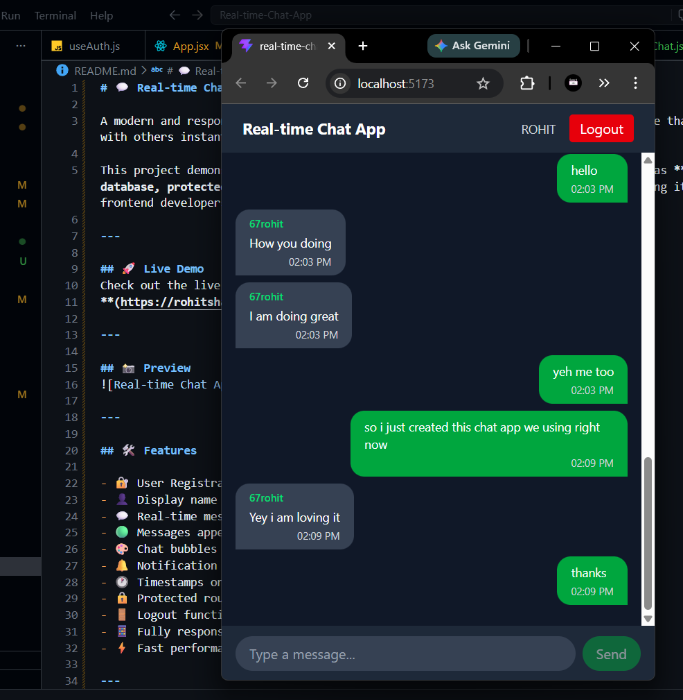

# 💬 Real-time Chat App

A modern and responsive **Real-time Chat Application** built with React and Firebase that allows users to register, login, and chat with others instantly in real time.

This project demonstrates real-world full-stack frontend development concepts such as **Firebase Authentication, Firestore real-time database, protected routing, custom hooks, and component-based architecture**, making it a strong portfolio project for aspiring frontend developers.

---

## 🚀 Live Demo
Check out the live version here:  
**(https://rohitshahrealtimechatapp.netlify.app/)**

---

## 📸 Preview


---

## 🛠️ Features

- 🔐 User Registration and Login with **Firebase Authentication**
- 👤 Display name support on registration
- 💬 Real-time messaging powered by **Firestore**
- 🟢 Messages appear instantly without page refresh
- 🎨 Chat bubbles — sent messages on right (green), received on left (gray)
- 🔔 Notification sound for incoming messages
- 🕐 Timestamps on every message
- 🔒 Protected routes — only logged in users can access chat
- 🚪 Logout functionality
- 📱 Fully responsive design
- ⚡ Fast performance with Vite

---

## ⚙️ Tech Stack

- **React JS**
- **Vite**
- **Tailwind CSS**
- **Firebase Authentication**
- **Firebase Firestore**
- **React Router**
- **JavaScript (ES6+)**
- **Component-Based Architecture**

---

## 🧠 Key Concepts Demonstrated

- Firebase Authentication (register, login, logout)
- Real-time data sync with **Firestore onSnapshot**
- Custom Hook — **useAuth** for global auth state
- Protected and Public Route wrappers
- Component separation (Navbar, MessageList, MessageBubble, MessageInput)
- **useRef** for auto-scroll and sound logic
- Notification sound using **Web Audio API**
- Responsive UI Design

---

## 📦 Installation

Clone the repository and install dependencies.

```bash
git clone https://github.com/rohitshah316/Real-time-Chat-App.git
cd Real-time-Chat-App
npm install
```

### 🔧 Environment Variables

Create a `.env` file in the root directory and add your Firebase config:

```env
VITE_FIREBASE_API_KEY=your_api_key
VITE_FIREBASE_AUTH_DOMAIN=your_auth_domain
VITE_FIREBASE_PROJECT_ID=your_project_id
VITE_FIREBASE_STORAGE_BUCKET=your_storage_bucket
VITE_FIREBASE_MESSAGING_SENDER_ID=your_messaging_sender_id
VITE_FIREBASE_APP_ID=your_app_id
```

### ▶️ Run Locally

```bash
npm run dev
```